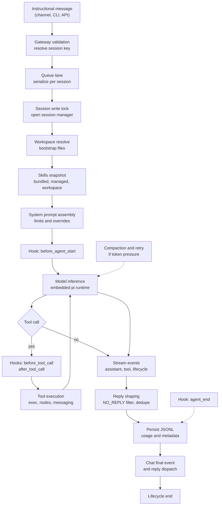

# Agent loop diagram with scaffolding

```mermaid
flowchart TD
  Inbound["Instructional message\n(channel, CLI, API)"] --> Validate["Gateway validation\nresolve session key"]
  Validate --> Queue["Queue lane\nserialize per session"]
  Queue --> Lock["Session write lock\nopen session manager"]
  Lock --> Workspace["Workspace resolve\nbootstrap files"]
  Workspace --> Skills["Skills snapshot\nbundled, managed, workspace"]
  Skills --> Prompt["System prompt assembly\nlimits and overrides"]
  Prompt --> HooksStart["Hook: before_agent_start"]
  HooksStart --> Model["Model inference\nembedded pi runtime"]
  Model --> ToolDecision{"Tool call"}
  ToolDecision -->|yes| ToolHooks["Hooks: before_tool_call\nafter_tool_call"]
  ToolHooks --> ToolExec["Tool execution\nexec, nodes, messaging"]
  ToolExec --> Model
  ToolDecision -->|no| Stream["Stream events\nassistant, tool, lifecycle"]
  Model --> Stream
  Stream --> ReplyShape["Reply shaping\nNO_REPLY filter, dedupe"]
  ReplyShape --> Persist["Persist JSONL\nusage and metadata"]
  Persist --> ChatFinal["Chat final event\nand reply dispatch"]
  ChatFinal --> End["Lifecycle end"]
  Compaction["Compaction and retry\nif token pressure"] -.-> Model
  HooksEnd["Hook: agent_end"] -.-> Persist
```
