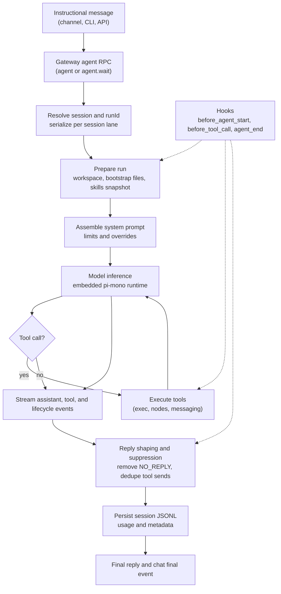

# Agent loop diagram

```mermaid
flowchart TD
  Inbound["Instructional message<br/>(channel, CLI, API)"] --> AgentRPC["Gateway agent RPC<br/>(agent or agent.wait)"]
  AgentRPC --> Resolve["Resolve session and runId<br/>serialize per session lane"]
  Resolve --> Prepare["Prepare run<br/>workspace, bootstrap files, skills snapshot"]
  Prepare --> Prompt["Assemble system prompt<br/>limits and overrides"]
  Prompt --> Model["Model inference<br/>embedded pi-mono runtime"]
  Model --> ToolDecision{"Tool call?"}
  ToolDecision -->|yes| ToolExec["Execute tools<br/>(exec, nodes, messaging)"]
  ToolExec --> Model
  ToolDecision -->|no| Stream["Stream assistant, tool, and lifecycle events"]
  Model --> Stream
  Stream --> ReplyShape["Reply shaping and suppression<br/>remove NO_REPLY, dedupe tool sends"]
  ReplyShape --> Persist["Persist session JSONL<br/>usage and metadata"]
  Persist --> Final["Final reply and chat final event"]
  Hooks["Hooks<br/>before_agent_start, before_tool_call, agent_end"] -.-> Prepare
  Hooks -.-> ToolExec
  Hooks -.-> ReplyShape
```
