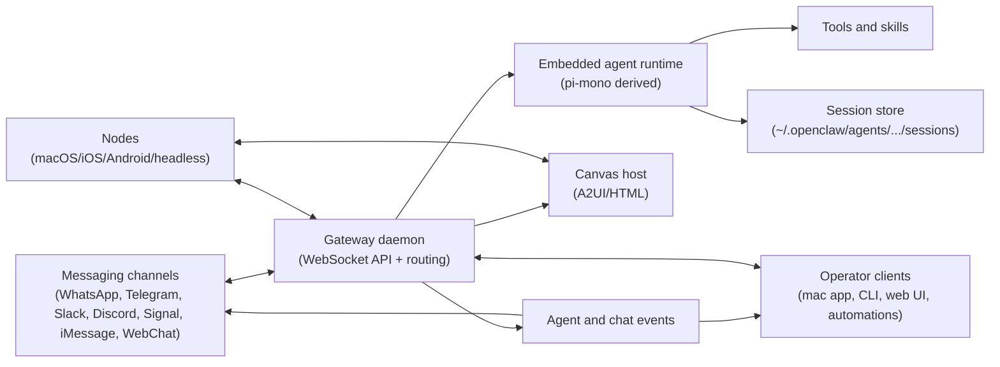

# System diagram

```mermaid
flowchart LR
  Channels["Messaging channels<br/>(WhatsApp, Telegram, Slack, Discord, Signal, iMessage, WebChat)"] <--> Gateway["Gateway daemon<br/>(WebSocket API + routing)"]
  Clients["Operator clients<br/>(mac app, CLI, web UI, automations)"] <--> Gateway
  Nodes["Nodes<br/>(macOS/iOS/Android/headless)"] <--> Gateway
  Gateway --> Agent["Embedded agent runtime<br/>(pi-mono derived)"]
  Agent --> Tools["Tools and skills"]
  Agent --> Sessions["Session store<br/>(~/.openclaw/agents/.../sessions)"]
  Gateway --> Canvas["Canvas host<br/>(A2UI/HTML)"]
  Nodes <--> Canvas
  Gateway --> Events["Agent and chat events"]
  Events --> Clients
  Events --> Channels
```
